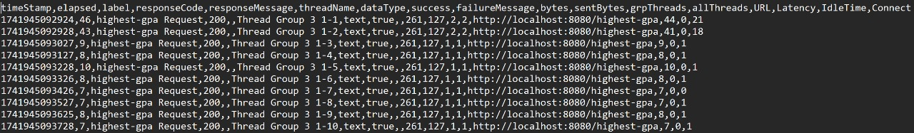

# Exercise-Profiling
###### Athallah Damar Jiwanto - B - 2306245024

### Module 5

<b>Profiling Results</b>

#### Before Optimization

#### After Optimization method getAllStudentWithCourse

---

### All-Student-Name

#### Before Optimization

#### After Optimization method joinStudentNames

---

### Highest-GPA

#### Before Optimization

#### After Optimization method findStudentWithHighestGpa

---
## Conclusion
Setelah melakukan optimisasi pada beberapa method untuk setiap endpoint yang terkait,
saya melihat perbedaan yang cukup signifikan.

<b>Reflection 1</b>

> 1. What is the difference between the approach of performance testing with JMeter and profiling with IntelliJ Profiler in the context of optimizing application performance? 

Performance testing dengan JMeter lebih fokus untuk melihat performa aplikasi secara keseluruhan, 
khususnya saat kondisi banyak pengguna atau load tinggi. Sedangkan profiling pakai IntelliJ Profiler lebih spesifik ke 
dalam kode aplikasi, kita bisa tahu bagian kode mana yang paling lambat atau bermasalah. Jadi singkatnya, JMeter dibuat untuk
melihat performa umum dan IntelliJ Profiler buat analisis detail pada kode.

> 2. How does the profiling process help you in identifying and understanding the weak points in your application?

Menurut saya IntelliJ Profiler ini cukup membantu dalam analisisnya karena kita bisa melihat informasi tersebut langsung pada
flame graph, call tree, dan timeline yang lumayan mudah untuk dipahami. Lalu, kita bisa langsung loncat ke bagian kode yang 
bermasalah, tanpa harus navigasi manual.

> 3. Do you think IntelliJ Profiler is effective in assisting you to analyze and identify bottlenecks in your application code?

Iya, cukup efektif. IntelliJ Profiler lumayan jelas nunjukin bagian kode mana yang bermasalah, 
terutama lewat fitur flame graph dan call tree-nya. Dengan fitur tersebut, saya pribadi bisa dengan mudah men-spot 
akar permasalahannya.

> 4. What are the main challenges you face when conducting performance testing and profiling, and how do you overcome these challenges?

Pada awalnya, tantangan utamanya adalah memahami hasil dari profiling tersebut, dimana saya masih kurang paham fitur-fitur yang disediakan.
Lalu, saya juga cukup kesulitan karena terkadang hasilnay tidak konsisten. Oleh karena itu, cara saya meng-handlenya adalah dengan
melakukan pengujian berulang untuk memastikan hasilnya stabil, lalu mempelajari lebih dalam visualisasi dari profiling biar tahu jelas titik perbaikannya.

> 5. What are the main benefits you gain from using IntelliJ Profiler for profiling your application code?

Manfaat utamanya adalah kemudahan dalam menemukan masalah performa di kode secara cepat dan jelas. Dibanding hanya membaca log 
atau kode manual, pakai IntelliJ Profiler jauh lebih cepat dan mudah untuk menemukan dan menentukan titik masalah sehinga hal
yang harus dapat diperbaiki lebih jelas.

> 6. How do you handle situations where the results from profiling with IntelliJ Profiler are not entirely consistent with findings from performance testing using JMeter?

Kalau ada perbedaan, biasanya saya melakukan tes ulang sembari memastikan kondisinya sama persis antara keduanya. 
Setelah itu, saya analisis lagi lebih detail bagian yang beda tersebut dan baru menentukan implementasi yang baiknya gimana.

> 7. What strategies do you implement in optimizing application code after analyzing results from performance testing and profiling? How do you ensure the changes you make do not affect the application's functionality?

Setelah dapat hasilnya, saya pilih dulu metode mana yang paling perlu diperbaiki. Lalu, saya lakukan refactoring, 
seperti mengganti algoritma yang lambat jadi lebih cepat dan menggunakan struktur data yang lebih pas. Untuk memastikan 
perubahan nggak mempengaruhi fungsi aplikasi, saya melakukan pengujian ulang secara menyeluruh setelah refactoring.

